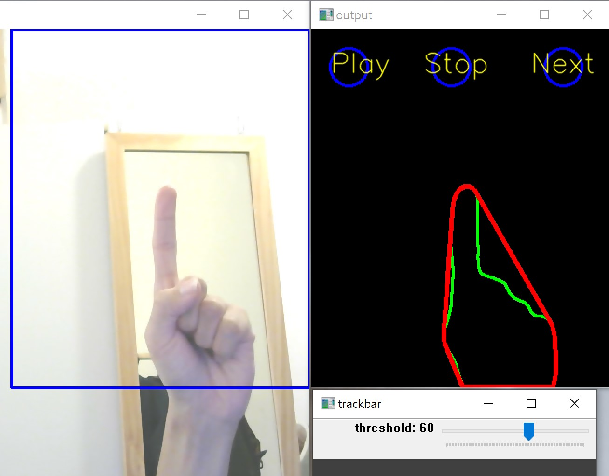

# TouchlessUI
opencv background substraction

## Overview
使用攝影頭偵測手部motion進行touchless介面控制
Play: 播放音樂
Stop: 停止音樂
Next: 播放下一首

## Steps
a. 偵測Motion
採用Gaussian Mixture-based Background 演算法，使用opencv內建function “BackgroundSubtractorMOG2” 在藍框熱區裡做背景相減運算，搭配threshold濾掉雜訊，進而偵測出關鍵motion變化。

b. 尋找輪廓並計算最高點
利用opencv function findContours() 來取得輪廓資訊，再根據y值取得輪廓最高座標點，如此一來即可以運算指尖的座標。

c. 音樂程式控制
使用python-vlc套件進行音樂程式控制。
備註：若使用python 64bit，則需安裝vlc 64bit作為對應。

## Screenshot

